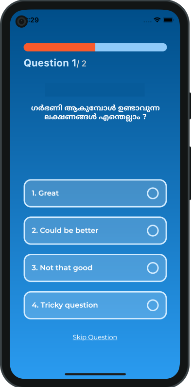
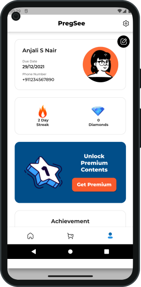

# Pregsee💔 - Shelved(2020-2022) 
A comprehensive pregnancy support app using Flutter and Firebase, offering personalized tracking, health tips, and community engagement features. Focused on enhancing user experience and retention through intuitive UI and seamless performance.Features include Firebase Authentication, Firestore, Pushnotification, Dynamic content through RestAPI.


## Features
- Secure authentication using Firebase
- Firestore of datastorage
- Video lessons personalised for each user
- Firebase Cloud notification
- Vimeo CDN content delivery
- Cross-platform support (Android, iOS)

## Screenshots
 
 
 


## Tech Stack
- **Frontend:** Flutter (Dart)
- **Backend:** Firebase (Authentication, Firestore, Functions)

## Installation
### Prerequisites
Ensure you have the following installed:
- Flutter SDK ([Installation Guide](https://flutter.dev/docs/get-started/install))
- Dart
- Android Studio / Xcode
- Firebase CLI (for Firebase setup)

### Steps to Run Locally
1. Clone the repository:
   ```sh
   git clone https://github.com/the-sreejith/pregsee.git
   cd pregsee
   ```

2. Install dependencies:
   ```sh
   flutter pub get
   ```

3. Set up Firebase:
   - Create a Firebase project on [Firebase Console](https://console.firebase.google.com/)
   - Enable Firebase Authentication (Phone Auth Sign-In)
   - Enable Firestore Database
   - Download `google-services.json` (for Android) and `GoogleService-Info.plist` (for iOS) and place them in the respective directories.

4. Run the application:
   ```sh
   flutter run
   ```

## Project Structure
```
flutter-video-call-app/
│-- lib/
│   │-- main.dart  # Entry point
│   │-- screens/   # UI screens
│   │-- services/  # Firebase and other service logic
│   │-- widgets/   # Reusable UI components
│-- android/       # Android-specific code
│-- ios/           # iOS-specific code
│-- pubspec.yaml   # Dependencies
│-- README.md      # Project documentation
```

## Contributing
1. Fork the project
2. Create a feature branch (`git checkout -b feature-name`)
3. Commit your changes (`git commit -m 'Add new feature'`)
4. Push to the branch (`git push origin feature-name`)
5. Open a Pull Request

## License
This project is licensed under the MIT License - see the [LICENSE](LICENSE) file for details.

